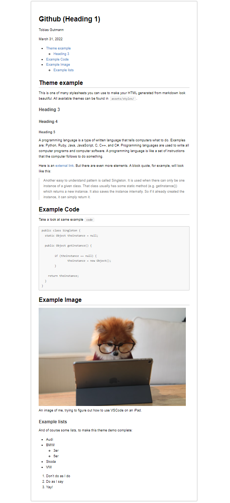
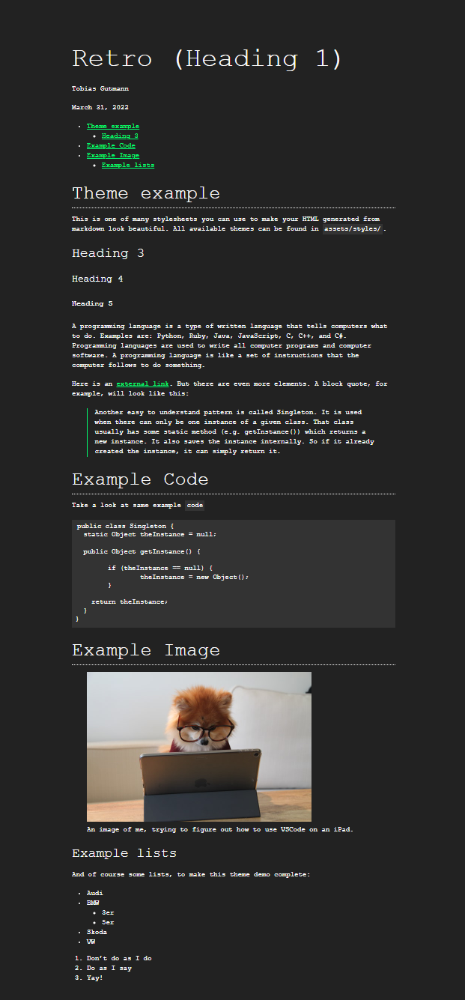
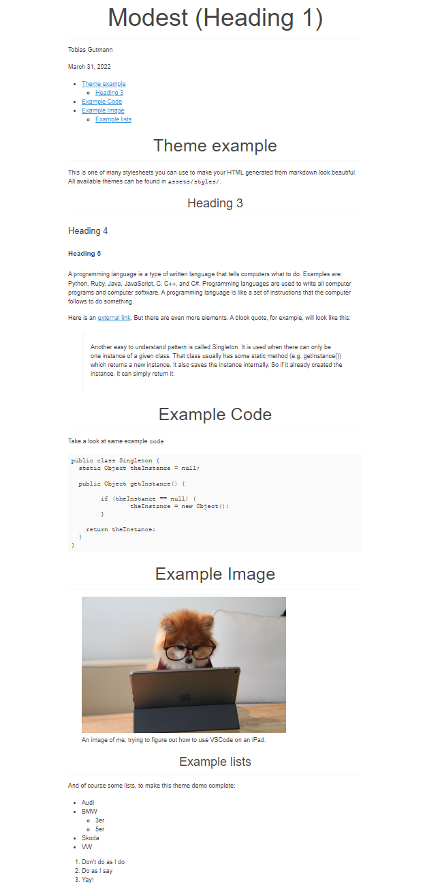
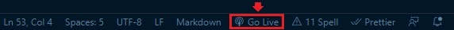

## Introduction

Have you ever just wanted to write something and not think about formatting? This project will help! While there are many online editors for markdown, I don't want to rely on an online connection to simple put down some notes. 


If you, like me, just want something that renders your markdown to beautiful HTML, reloads your browser on any changes and includes a table of contents at the top of your document, you can finally rest easy. Follow the instructions laid out for you in the [Getting started](#getting-started) section. Then, proceed to [Customizing](#customizing) to learn how you can change the styling and more.


## Features

While you can easily extend and customize this repo to fit your needs, these features are provided for you out of the box:

- Live reloading
- Works offline
- Table of contents
- Easily extendable
- Multiple stylesheets available
- Responsive HTML

## Available themes

### Github



### Retro 


### Modest


## Requirements

- pandoc
- VSCode

## Getting started

### Clone this repo

```
git clone git@github.com:Karl-Heinrich/markdown-to-html.git
```

### Install dependencies

Debian / Ubuntu / Kubuntu etc.

```
sudo apt install pandoc
```

macOS

```
brew install pandoc
```

For detailed instructions, visit [pandoc.org](https://pandoc.org/installing.html)

### Install required VSCode extensions

Either go to the extensions menu and install the recommended extensions for this workspace or you can run the following commands:
```
code --install-extension emeraldwalk.RunOnSave
code --install-extension ritwickdey.LiveServer
```

### Start the live server

Next, start the live server by hitting the button on the lower right corner of VSCode, which in the following screenshot is highlighted by a red rectangle.



This will start a server on `localhost:5500` if that port is available. Navigate to [localhost:5500/dist/about.md.html](localhost:5500/dist/about.md.html) to take a look at this document in your browser.

### Start editing

That's it, you're done! By default, every file you create inside the `src/` folder will be rendered to HTML and is available in the `dist/` folder. Open the file in your browser with live server running and you should see you changes being updated once you save.

## Customizing

### Changing the theme

The themes are located in `assets/styles` as `*.css` files. You can add your own or use one of the existing stylesheets. To change the theme, navigate to `script/render.sh` and search for this line

```
pandoc --toc "$file" -s -o ../dist/"$file".html --css ../assets/styles/retro.css
```

At the end of the command, the stylesheet to use is declared. If you want to change it to another theme, simply change the path at the end where it says `retro.css`. E.g. to switch to the `github.css` theme file, replace the above line with the following:

```
pandoc --toc "$file" -s -o ../dist/"$file".html --css ../assets/styles/github.css
```

Currently available themes are:

```
github.css
modest.css
retro.css
```

### Removing the table of contents

To remove the table of contents, navigate to `script.render.sh` and delete the command option `--toc` from this line

```
pandoc --toc "$file" -s -o ../dist/"$file".html --css ../assets/styles/retro.css
```
